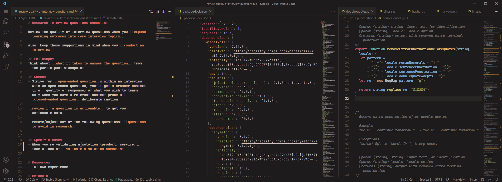

# README

Set of dark themes for VS Code, including syntax highlighting, debugging and terminal colors. 

## Screenshots

## Installation

**Prerequisite: VS Code**
1. Install [Visual Studio Code](https://code.visualstudio.com/)
2. Launch Visual Studio Code

**Installing the theme**
1. Choose **Extensions** from the Activity Bar
2. Search for `B Theme`
3. Click **Install** to install it
4. Click **Reload** to reload the Visual Studio Code
5. Open `Preferences: Color Theme` from the command palette and select the preferred flavor of the **B** Theme

## Feedback

Share your feedback as a [GitHub issue](https://github.com/surfinzap/b-theme-vscode/issues).

## Support 

[Buy me a coffee](https://ko-fi.com/branosandala) to support this project. 

## Inspiration

- Syntax highlighting rules inpiration: [vscode-theme-gruvbox](https://github.com/jdinhify/vscode-theme-gruvbox)