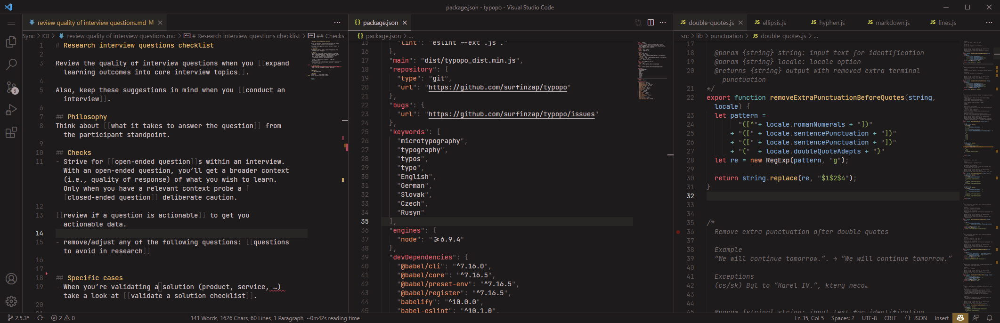

# README

A dark warm theme for VS Code. 

## Screenshots

## Installation

1. Install [Visual Studio Code](https://code.visualstudio.com/)
2. Launch Visual Studio Code
3. Choose **Extensions** from menu
4. Search for `B Theme`
5. Click **Install** to install it
6. Click **Reload** to reload the Visual Studio Code
7. From the menu bar select: Code > Preferences > Color Theme > **B Theme**

## Feedback

Share your feedback as a [GitHub issue](https://github.com/surfinzap/b-theme-vscode/issues)

## Making your own

If you’d like to tweak this theme, there is:
- [color scheme](schemes/b-default.json)
- [VS code template with scheme variables](templates/b-default-vscode.mustache)

Use a [python script](theme-generator.py) to generate your theme.

## Inspiration
- Syntax highlighting rules inpiration: [vscode-theme-gruvbox](https://github.com/jdinhify/vscode-theme-gruvbox)