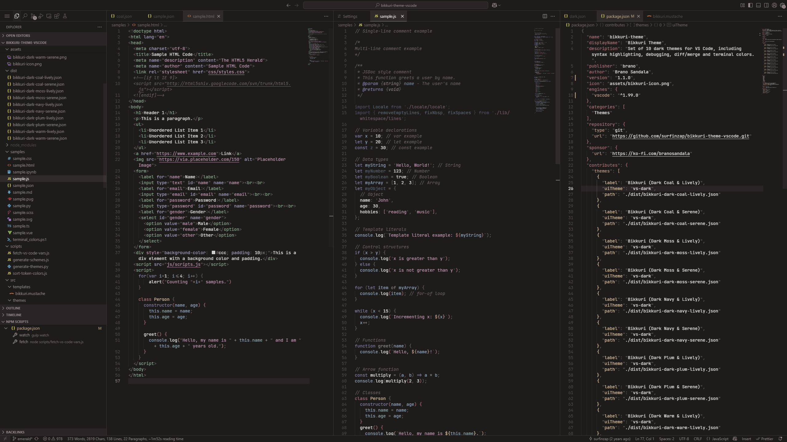
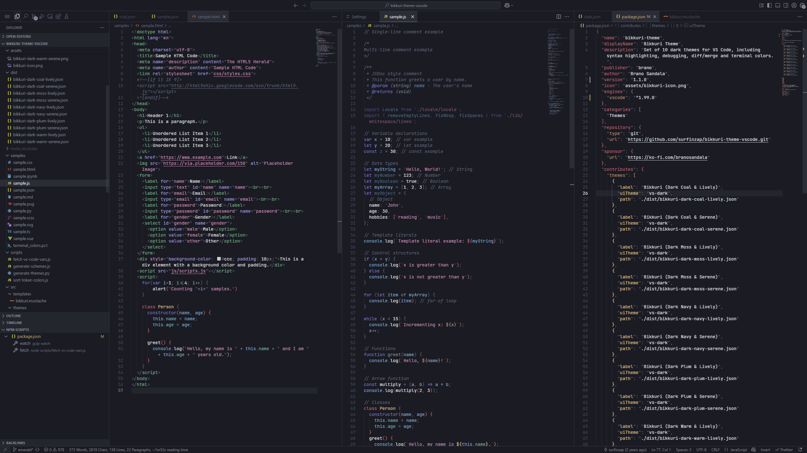
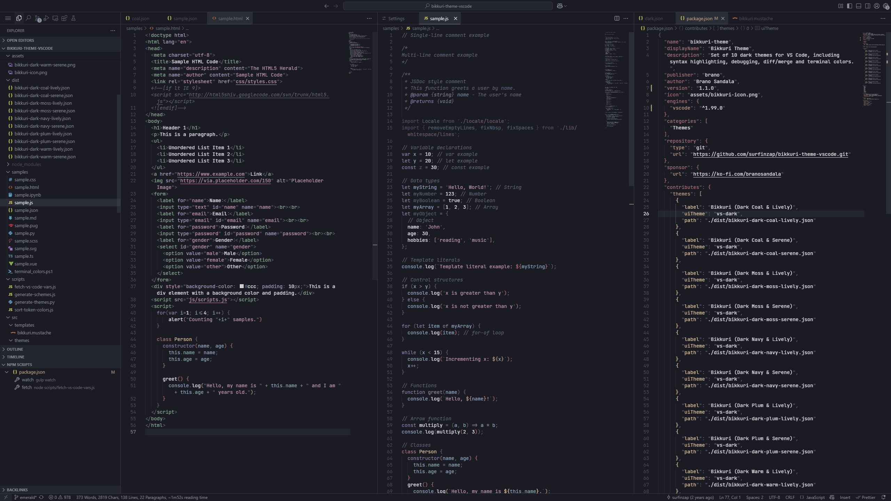
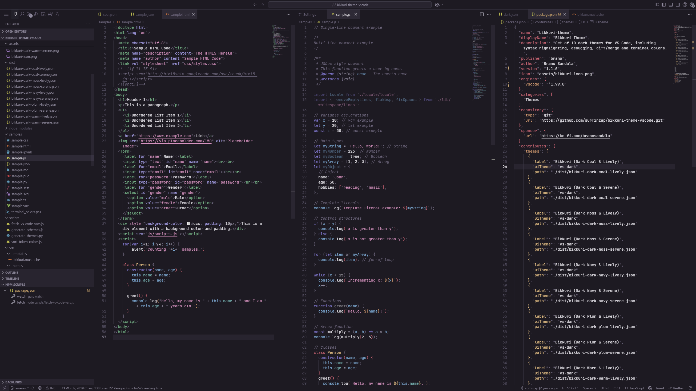
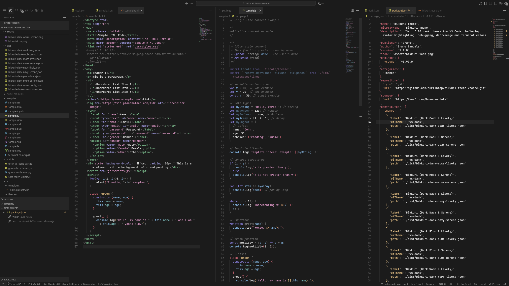
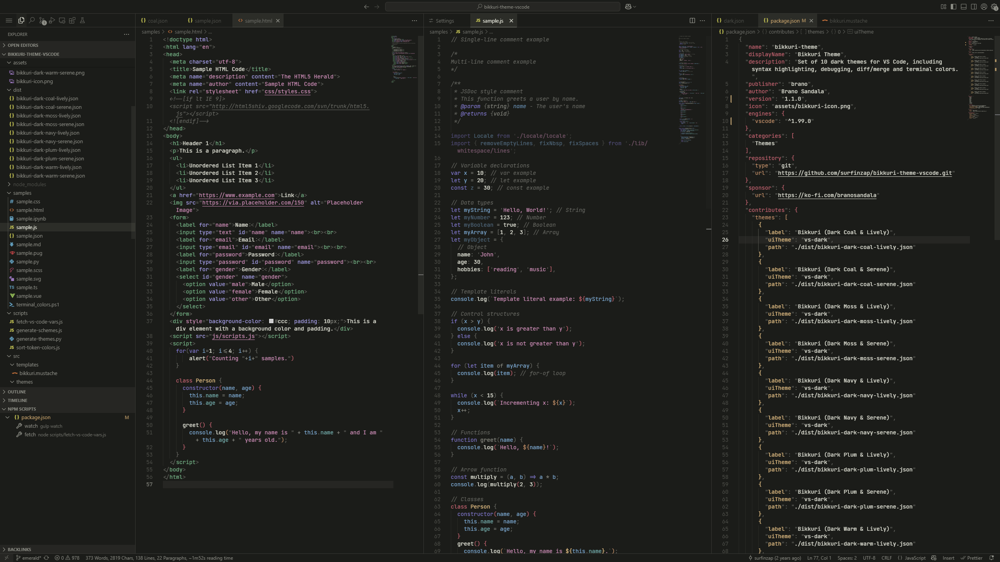
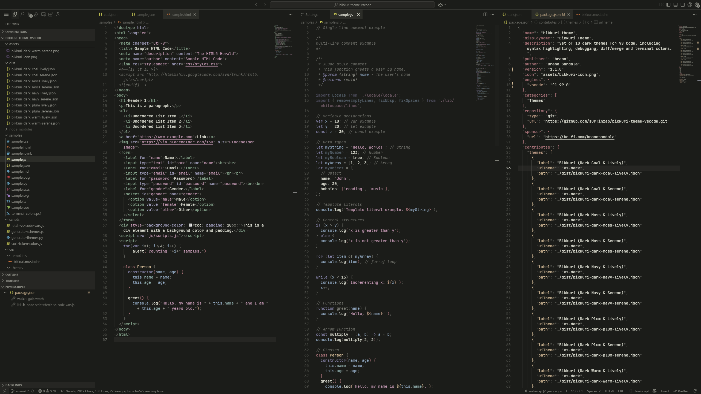

<h1 align="center">
   
  
   
  Bikkuri Theme
   
</h1>

Set of 10 dark themes for VS Code, including syntax highlighting, debugging, diff/merge and terminal colors.

## Variants

### Dark Warm & Lively

### Dark Warm & Serene

### Dark Navy & Lively

### Dark Navy & Serene

### Dark Plum & Lively

### Dark Plum & Serene

### Dark Coal & Lively

### Dark Coal & Serene

### Dark Moss & Lively

### Dark Moss & Serene

## Installation

**Prerequisite: VS Code**
1. Install [Visual Studio Code](https://code.visualstudio.com/)
2. Launch Visual Studio Code

**Installing the theme**
1. Choose **Extensions** from the Activity Bar
2. Search for `Bikkuri Theme`
3. Click **Install** to install it
4. Click **Reload** to reload the Visual Studio Code
5. Open `Preferences: Color Theme` from the command palette and select the preferred flavor of the **Bikkuri** Theme

## Feedback

Share your feedback as a [GitHub issue](https://github.com/surfinzap/bikkuri-theme-vscode/issues).

## Support 

[Buy me a coffee](https://ko-fi.com/branosandala) to keep the themes up-to-date. 

## Inspiration / Recommendations

- colors for the theme were designed with [Colorca](https://colorca.org)
- the theme plays nicely with [JetBrains Mono](https://github.com/JetBrains/JetBrainsMono) font