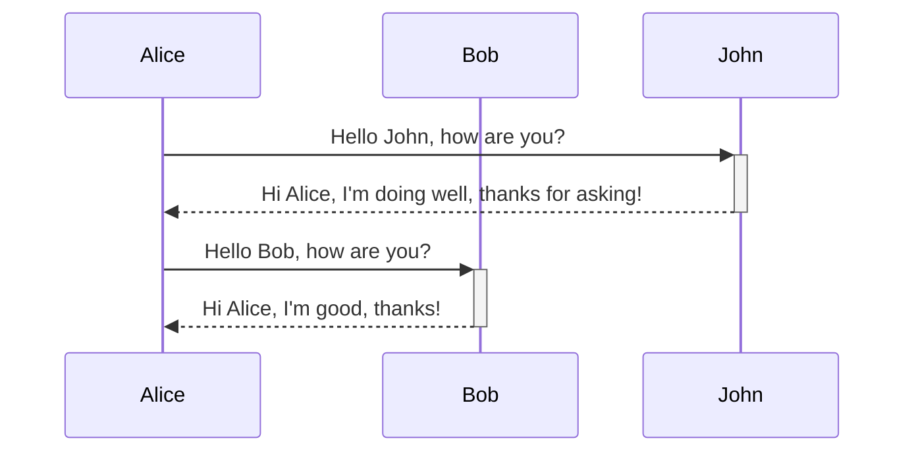
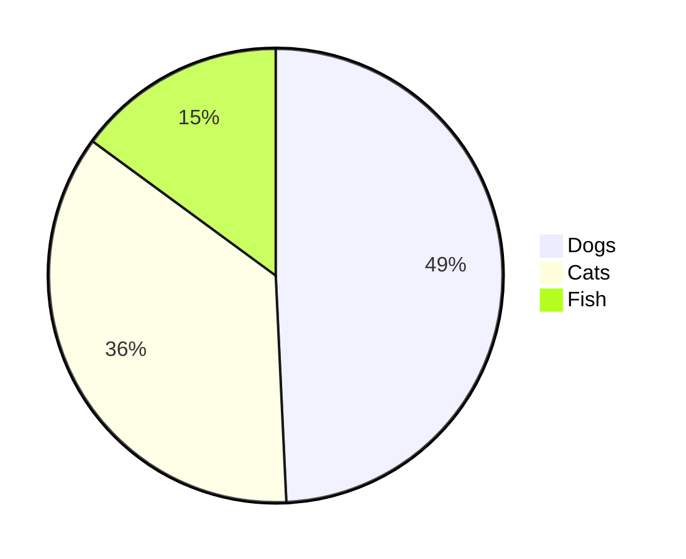
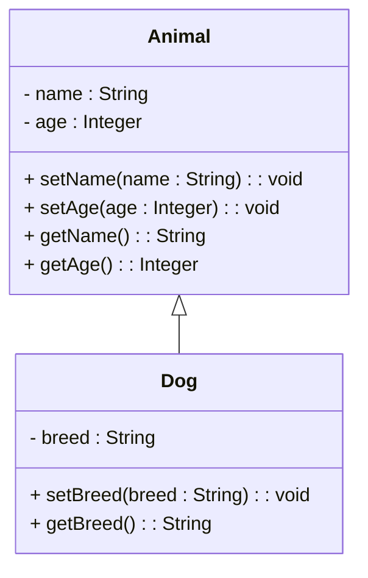
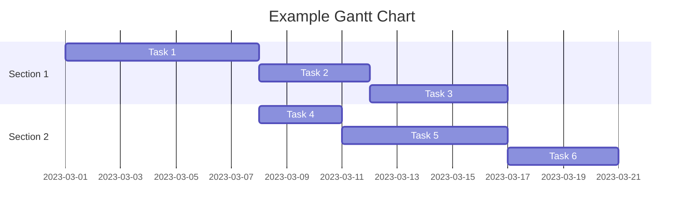

# Header 1

This is some **bold text** and some *italic text*.

## Header 2

Here’s a list of items:
- Item 1
- Item 2
- Item 3

### Header 3

This is a blockquote:

> Lorem ipsum dolor sit amet, consectetur adipiscing elit. Vivamus maximus sit amet mauris nec lacinia. Fusce bibendum magna sed ex vestibulum, eu tincidunt risus sodales.

#### Header 4

This is a table:

| Column 1 | Column 2 | Column 3 |
|----------|----------|----------|
| Cell 1   | Cell 2   | Cell 3   |
| Cell 4   | Cell 5   | Cell 6   |

##### Header 5

This is a code block:

```python
def hello_world():
    print("Hello, World!")
    
hello_world()
```

This is a horizontal rule:

---

This is some more text. You can also create [links](https://www.example.com) and include images:


And here’s some inline code: `print("Hello, World!")`

And here’s some ~~strikethrough~~ text.

```mermaid
graph TD %% Comment 
OUTCOME(Desired Outcome) 
OUTCOME--> OPP1(Opportunity 1) & OPP2(Opportunity 2) & OPP3(Opportunity 3)
OPP1 --> IDEA1(Solution idea 1) & IDEA2(Solution idea 2) & IDEA3(...)
IDEA1 --> EXP1(Experiment A) & EXP2(Experiment B) & EXP3(...)
```







